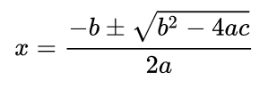

**This project is on indefinite hold.**

The idea to use ANSII escape codes and unicode symbols for equation formatting is appealing, but terminal support is just not what you'd wish it to be.

I wrote `quad.sh` as a test of terminal features. It prints a few variants of a manually converted forms of the quadratic formula.

On the left with poor unicode support is the default WSL terminal, on the right is [Mintty](https://github.com/mintty/wsltty).

_Old description remains below for archiving reasons._

# fancyASCII
A monospaced document formatter.
The ASCII part of the name is potentially a misnomer, as using unicode for math-symbols etc is useful.

## Wait, What?
FancyASCII intends to be many things.
  - a text formatter targetting monospace textfiles and text-mode terminal screens.
  - an extendable library of "FormatTypes", ML->ASCII definitions for special elements.

## FormatTypes
### Math(s)
Formats for many kinds of math, possibly based on courses I took recently.
  - Linear Algebra 
     - matrices
  - Relational Algebra
  - Symbolic Logic
    - Logical Derrivation Trees
  - Sentence diagrams

## Rationale
Prettier text-mode output for programs.
> Who doesn't love lynx?

Formatting for plaintext documents.
> All my class notes are text files. Using a markup language lets the user quickly define complex, odd, or rare elements/structures with a normal keyboard, w\o relying on copy-pasting special symbols.

## Possible additions
Things for later
  - support for MathML input
  - reversable translations that turn what is essentially "ASCII art" back into markup-form equations and paragraphs.
